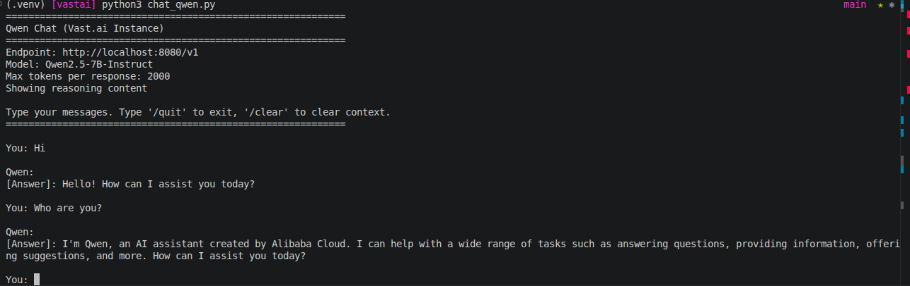
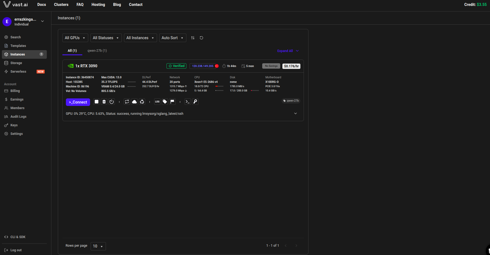
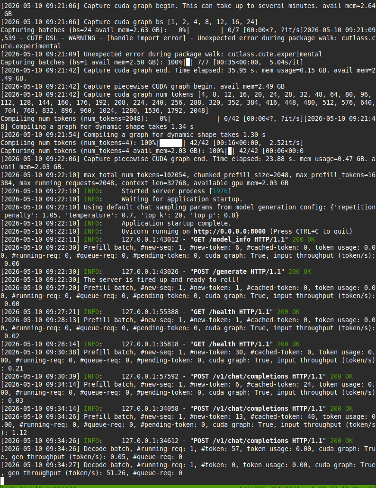

# Vast.ai Qwen Notes

This took a bit of trial and error, but it ended up working.

## What worked
```bash
ssh -p 10874 root@ssh3.vast.ai -L 8080:localhost:8000 -N
```

Then I could call the model from my laptop with:
```bash
python3 -c "
from openai import OpenAI
client = OpenAI(base_url='http://localhost:8080/v1', api_key='EMPTY')
response = client.chat.completions.create(
    model='Qwen2.5-7B-Instruct',
    messages=[{'role': 'user', 'content': 'Hola'}],
    max_tokens=50
)
print(response.choices[0].message.content)
"
```

## What went wrong
- I first used the wrong port. The model was on `8000`, not `8080`.
- I had to install the qwen model manually in the machine after many tries.
- `8080` was already busy on my machine, so the tunnel could not start.
- `test_ready.py` was not super useful here because the model was already up, but the health check was hanging.
- At one point SGLang was not running at all, so I had to start it manually.

## Final result
Qwen2.5-7B-Instruct is running on the VM on port `8000`, and I reach it locally through `8080`. Once the tunnel was clean, the OpenAI call worked fine.
I also created the GUIA_COMPLETA.md file with claude to help me deploying it step by step as in the first try with hotolaunch.md it goes wrong for me.

## ScreenShots
picture of the qwen_chat.py script working

vast.ai console 

picture of the ssh connection after putting to work the model

